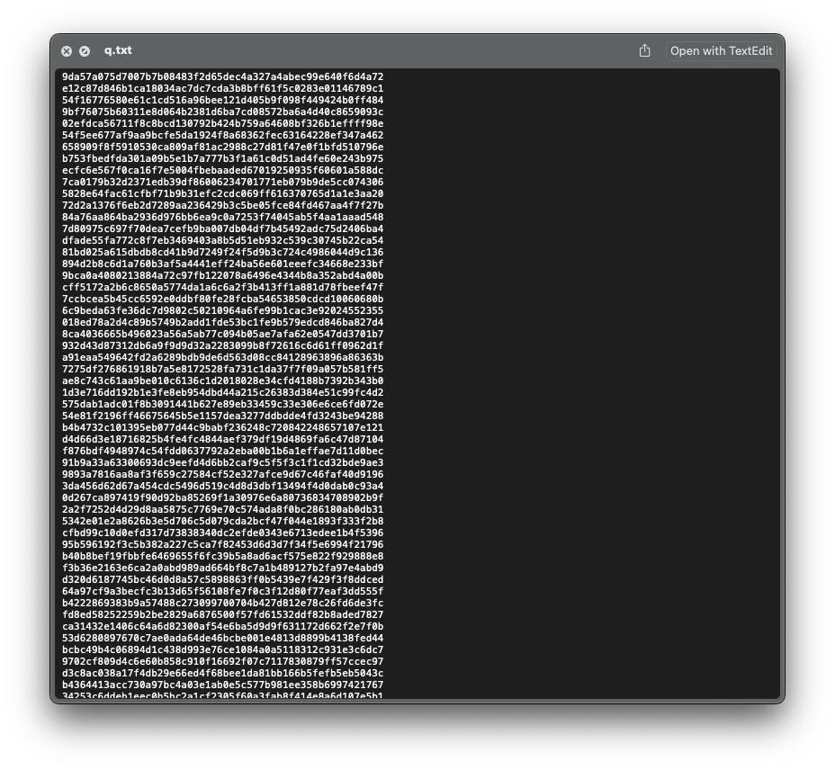

# Crypto
## baby_encryption
### Category
Crypto
### Points
38
### Challenge Description
One of the 60-character strings in this file has been encrypted by single-character XOR. Find it.
### Attached files
[q.txt](q.txt)
### Explanation
We see that 1.txt is a file written in hexadecimal charachters `(0-9,a-f)`. We're griven in the challenge description that one of the strings in this file has been XORed with a single charachter.

- XOR: A binary operation that takes two strings, converts them to binary, and for each corrosponding digit pair, returns 0 if both digits are 0 or 1, and returns 1 if one of the digits is 0 and the other is 1.
### Exploitation
We're supposed to brute force all of the strings with all the possible charachters in ASCII (There are 256 of them, by the way). This can be done by XORing the given strings with each charachter again (Why? Search up "Properties of XOR" on Google). Since there are multiple strings and only one of them is our flag, we won't be reading all of them. Instead, we can write a script in python to perform this brute force and return the string which has `d4rkc0de` in it.
### Exploitation Script
[baby_encryption_sol.py](baby_encryption_sol.py)

## Encryption_101
### Category
Crypto
### Points
92
### Challenge Description
Once there were 3 friends, each of them represent a number in the txt file.
### Attached files
[encrypt.py](encrypt.py), [encrypted-messages.txt](encrypted-messages.txt)

### break_it
- Category : Crypto
- Points : 100
- Chellenge Description: Can you break this encyption standard? `nc ctf.d4rkc0de.iiitd.edu.in 20003`
- Attached files: [chall3.py](chall3.py)
