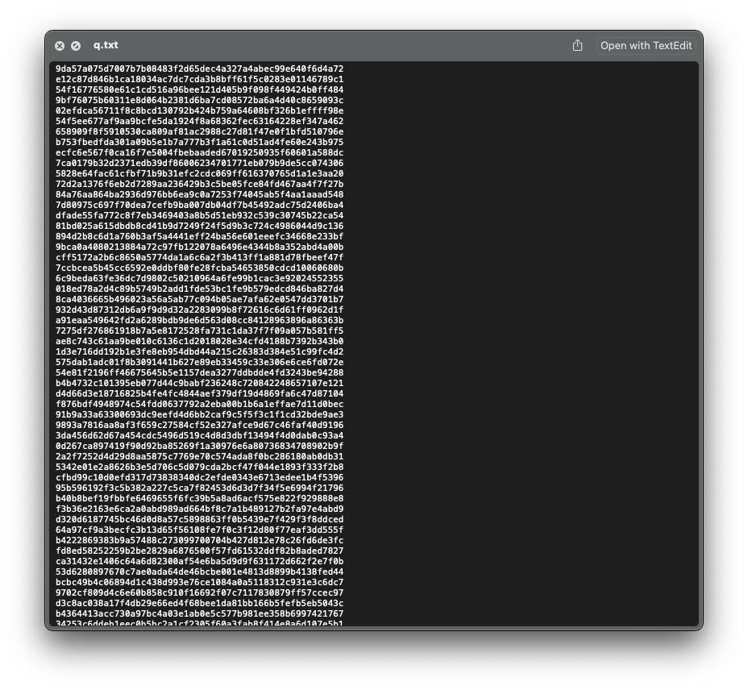
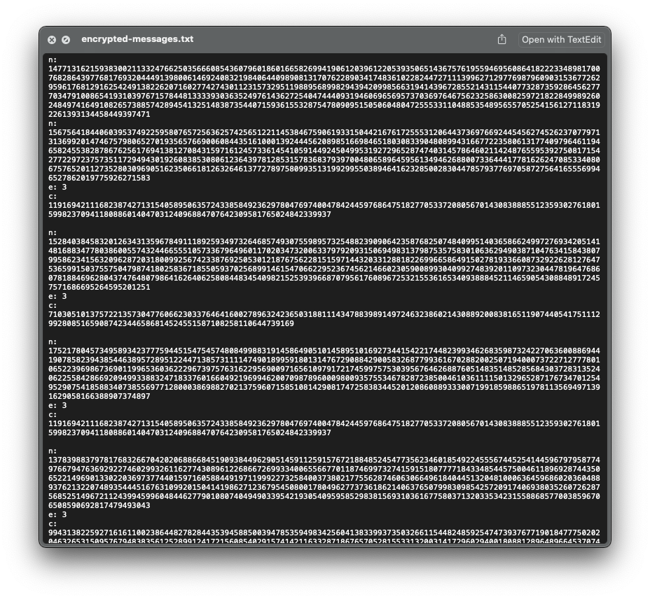
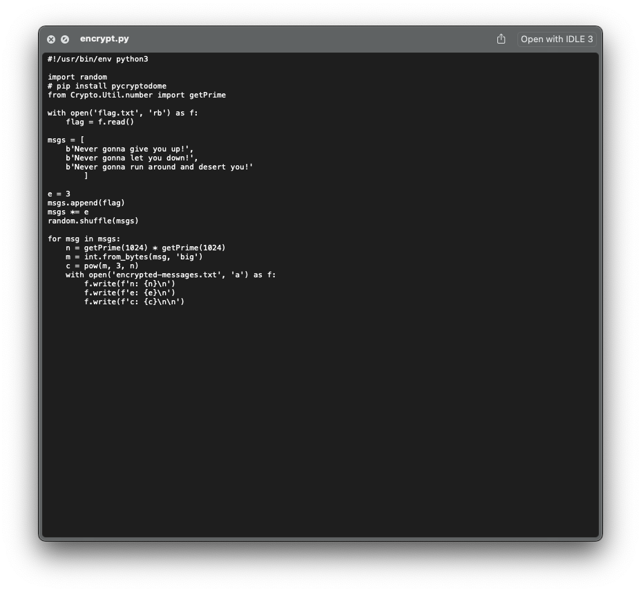
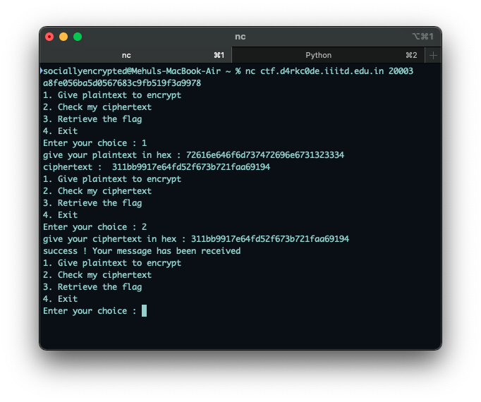
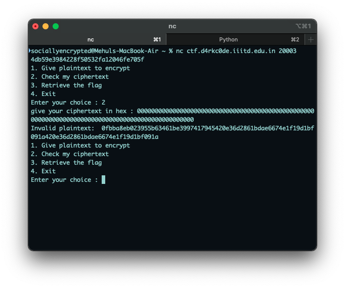

# Crypto
## baby_encryption
### Category
Crypto
### Points
38
### Challenge Description
One of the 60-character strings in this file has been encrypted by single-character XOR. Find it.
### Attached Files
[q.txt](q.txt)
### Explanation
We see that 1.txt is a file written in hexadecimal charachters `(0-9, a-f)`. We're griven in the challenge description that one of the strings in this file has been XORed with a single charachter.



- XOR: A binary operation that takes two strings, converts them to binary, and for each corrosponding digit pair, returns 0 if both digits are 0 or 1, and returns 1 if one of the digits is 0 and the other is 1.
### Exploitation
We're supposed to brute force all of the strings with all the possible characters in ASCII (There are 256 of them, by the way). This can be done by XORing the given strings with each charachter again (Why? Search up "Properties of XOR" on Google). Since there are multiple strings and only one of them is our flag, we won't be reading all of them. Instead, we can write a script in python to perform this brute force and return the string which has `d4rkc0de` in it.

### Brute Force
A brute force attack, also known as an exhaustive search, is a cryptographic hack that relies on guessing possible combinations of a targeted password until the correct password is discovered. The longer the password, the more combinations that will need to be tested.

### Exploitation Script
[baby_encryption_sol.py](baby_encryption_sol.py)
### Flag
`d4rkc0de{3ncrypt10n_!=_x0r}`

## Encryption_101
### Category
Crypto
### Points
92
### Challenge Description
Once there were 3 friends, each of them represent a number in the txt file.
### Attached files
[encrypt.py](encrypt.py), [encrypted-messages.txt](encrypted-messages.txt)
### Explanation
`encrypted-messages.txt` has 12 blocks of numbers, each with three numbers: `n`, `e`, `c`. 

Interestingly enough, all the `e`'s are 3. If you search `"n, e and c in cryptography"` on Google, you'll soon realise that this challenge is using the **RSA Cipher**.

---

**Note: RSA**

RSA (Rivest–Shamir–Adleman) is a public-key cryptosystem that is widely used for secure data transmission. In the most basic terms, it works by taking a message, `m`, converting it into bytes and then into an integer, then raising it to the power of the number `e` and taking the modulo `n` of the entire result, where n is a number generated by multiplying two random, large primes. 

This was thought to be secure because it is difficult to factorise large numbers, however, some common misconfiguraations make it prone to attacks.
This cryptography is widely used for data encryption of e-mail and other digital transactions over the Internet.

---

Now, let's try to understand the python script:


```python
with open('flag.txt', 'rb') as f:
    flag = f.read()

msgs = [
    b'Never gonna give you up!',
    b'Never gonna let you down!',
    b'Never gonna run around and desert you!'
        ]

e = 3
msgs.append(flag)
msgs *= e
random.shuffle(msgs)
```

This part of the code reads the flag, and adds it to a list of messages (get rickrolled xD), and then these messages are written in the list three times and shuffled

```python
for msg in msgs:
    n = getPrime(1024) * getPrime(1024)
    m = int.from_bytes(msg, 'big')
    c = pow(m, 3, n)
    with open('encrypted-messages.txt', 'a') as f:
        f.write(f'n: {n}\n')
        f.write(f'e: {e}\n')
        f.write(f'c: {c}\n\n')
```

Now, this is the part where the RSA cipher is applied. The `pow(m,3,n)` function is taking `m` to power `3` and taking the modulo by `n`. As it matches from our observation in `encrypted-messages.txt`, `e = 3` for each message.

### Exploitation
The only pattern we keep observing here is that `e = 3`. Searching `"RSA Attacks with e = 3"` on Google leads us to [this blog post](https://www.johndcook.com/blog/2019/03/06/rsa-exponent-3/) by John D. Cook. This matches our interest because for such an attack, we need three different cipher texts for each message, and because the python program generated three messages of the same type, we have them!

However, we don't know which ciphertext corrosponds to which message, because they were randomly shuffled. At this point, it is a good idea to take a look at `encrypted-message.txt` again. We observe that a particular set of ciphertexts, `c`, are being repeated over and over again! This means this RSA configuration is even more flawed as the `c < n` for each n. This makes it very easy to find out the flag.

Our methodology will be to take the `x = ci mod ni` for each cipher text we have, and then find out the `x^(1/3)` and convert it back into `bytes` from `int`. However, we can skip the first step as `c < n`.

You can search about converting int back to bytes and you'll get a lot of answers on Stack Overflow on how to do that.

One problem I faced was that the inbuilt functions or the math module in python weren't good enough to find out the cuberoot of large numbers like `c`. Searching `"How to find cuberoots of large numbers in Python"` on Google led me to [this blog](https://riptutorial.com/python/example/8751/computing-large-integer-roots) on RIP Tutorial which helped me a lot
### Exploitation Script
[encryption_101_sol.py](encryption_101_sol.py)
### Flag
`d4rkc0de{cr4ck1ng_RSA_101}`

## break_it
### Category
Crypto
### Points
100
### Challenge Description
Can you break this encyption standard?
### Attached files
[chall3.py](chall3.py)
### Server
`nc ctf.d4rkc0de.iiitd.edu.in 20003`
### Explanation
Let's try to understand the python script:
```python
from Crypto.Cipher import AES
import os
import sys

KEY = os.urandom(16) #unknown 16 byte key
with open('flag.txt', 'rb') as f:
    FLAG = f.read()
```
From the `import` statement, we get to know that this is an AES encryption. 

---

**Note: AES**

The Advanced Encryption Standard (AES) is a block cipher that finds its use in a lot of security operations. It is a symmetric operation, which means the same key is used to encrypt and decrypt the message. 

Even though it is secure in itself because even the smallest key is 16 bytes and cannot be brute-forced with modern hardware, some misconfigurations in a software can help us guess the key.

---

A random 16 bytes (128 bits) key is being generated here and stored in a global variable called key. This is followed by three functions: `encrypt()`, `recieve()` and `get_flag()`.

The first intuitive thought is to bruteforce the key, but as mentioned above, the key is too large to be bruteforced. Hence, we inspect the code further to find hints:
```python
def encrypt():
    text=input("give your plaintext in hex : ")
    plaintext = bytes.fromhex(text)
    if len(plaintext) % 16 != 0:
        return {"error": "Data length must be multiple of 16"}

    cipher = AES.new(KEY, AES.MODE_CBC, KEY)
    encrypted = cipher.encrypt(plaintext)

    print("ciphertext : ",encrypted.hex())
    sys.stdout.flush()


def get_flag():
    key=input("give key in hex : ")
    key = bytes.fromhex(key)

    if key == KEY:
        print(FLAG)
        sys.exit("Congrats n00b..")
    else:
        print("Wrong key")
        sys.stdout.flush()
```

We observe something interesting! The KEY for both the `encrypt()` function and `get_flag()` function is same! This makes it easier for us to guess the key. Searching a bit about `"same key AES attacks"` led me to a few sources:
- [A Stack Overflow answer](https://crypto.stackexchange.com/a/88495)
- [A writeup from Swamp CTF](https://blog.h25.io/SwampCTF-AES/)

Both of them tell us to decrypt some made-up ciphertexts to obtain the key. We hence `netcat` into the server to run the python script.

---

**Note: NetCat (`nc`)**

`nc` is a useful terminal command that allows us to connect to a certain port on a certain server and recieve data from there. 

In this case, `ctf.d4rkc0de.iiitd.edu.in` is the server and `20003` is the port we're connecting to. The python script given above is running on the given port number. 

The difference between running the python script on our device and on the server is that the server has the real flag, while we do not have it.

---

We try selecting the decrypt option and enter something random. Maybe let's convert something like `"randomstring1234"` to hex in python, encrypt it in the program, and then pass it?

```python
>>> "randomstring1234".encode('utf-8').encode("hex")
'72616e646f6d737472696e6731323334'
```



We just get a message saying:
`success ! Your message has been received`
 Doesn't work. Let's inspect the python code again.

 ```python
 def receive():
    text=input("give your ciphertext in hex : ")
    ciphertext = bytes.fromhex(text)
    if len(ciphertext) % 16 != 0:
        print("Data length must be multiple of 16")
        sys.stdout.flush()

        return None

    cipher = AES.new(KEY, AES.MODE_CBC, KEY)
    decrypted = cipher.decrypt(ciphertext)

    try:
        decrypted.decode() # ensure plaintext is valid ascii
    except UnicodeDecodeError:
        print("Invalid plaintext: ",decrypted.hex())
        sys.stdout.flush()
        
        return None

    print("success ! Your message has been received")
    sys.stdout.flush()
```

The script only prints the plaintext if it contains invalid ASCII characters. So we can try something random like `000000000000000000000000000000000000000000000000000000000000000000000000000000000000000000000000` (96 0s)



Voila! It works!

Now, we just need to split the result into blocks and XOR them. We can write a script for this in python and hence obtain the key. We don't need to XOR with the cipher as `0 xor x = x`

```python
a = "0fbba8eb023955b63461be3997417945420e36d2861bdae6674e1f19d1bf091a420e36d2861bdae6674e1f19d1bf091a"
a1 = a[:32]
a2 = a[32:64]
x = hex(int(a1, 16) ^ int(a2, 16))
print(x)
```
We get `key = 4db59e3984228f50532fa12046fe705f`
Entering this into the 3rd option of the python program gives the flag!

### Flag
`d4rkc0de{s0_u_4r3_th3_A3S_g0d_31337}`
