# Web
## Inspector
### Category
Web
### Points
50
### Challenge Description
You know what to do.

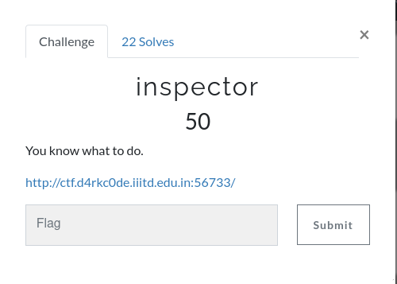 
### Link
[http://ctf.d4rkc0de.iiitd.edu.in:56733/](http://ctf.d4rkc0de.iiitd.edu.in:56733/)  
### Exploitation 
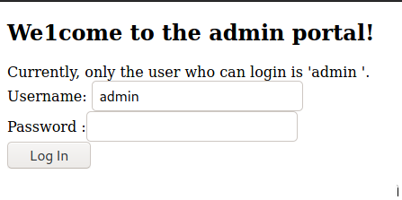  
We have a login field, we can try to enter a few common logins to check if any of them work.

    Username: admin
    Passwords: {empty}, admin, root 

None of these worked. :(  
#### Inspecting the Source Code
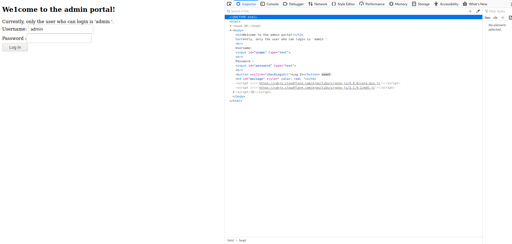  
Let's try opening the `<head>` and `<script>` tags as we do not see anything important in the `<body>` tag.

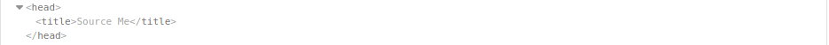  
  
Aha! A hint at last.  
  
Source Me? Maybe we need to keep looking through the source code.  
  
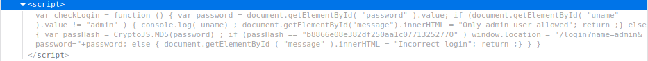  
  
This looks rather interesting.  
  
A quick read through it revealed this for us:  
  
  
  
    var passHash = CryptoJS.MD5(password) ;  
    if (passHash == "b8866e08e382df250aa1c07713252770" ) 
  
Oh this looks interesting, cause there is an “if” statement which is basically checking if the “Hash” of the entered text in the “password” field matches the pre entered characters, if it matches we can get the answer.  
  
Maybe let's try entering the hash itself into the password field.  
  
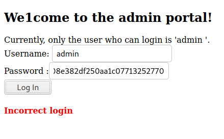  
  
Oops! Did not work :(  
  
Why did it not work? Let's understand.  
So, basically what the script is doing is, it takes the data you entered into the field and then uses the “CryptoJS” library of javascript to encrypt the data using the “MD5” hashing algorithm.  
  
#### Note: MD5
MD5 is simply **the name for a type of cryptographic hashing function** Ron came up with, way back in '91. The idea behind cryptographic hashing is to take an arbitrary block of data and return a fixed-size "hash" value. It can be any data, of any size but the hash value will always be fixed.  
  
Okay makes a bit more sense, so this means it's not comparing the hash we entered with the pre defined hash as it is, it is actually hashed again and then compared. Interesting. So, what if we decrypt this text back into simple english and then pass it into the field? This way it would hash that normal text and the if statement will execute as both of them will be equal.  
  
We need a MD5 decrypter. Heading on to Google.  
  
Found this: [https://md5decrypt.net/en/](https://md5decrypt.net/en/) (Second link on the main page)  
  
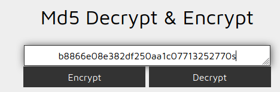  
  
Click on Decrypt
  
  
Wow, that was fast, so seems like we have the password. Not a very good password though. xD  
  
Let's trying put it back into the password field with the admin username.  

    username = admin  
    password = password2345
  
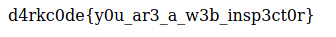  
  
Hey! We got the Flag. A very clever one :)
Congrats on the 50 points!! 

#### Note: l33tsp34k
A variety of spelling that uses numbers and symbols that approximate the shape of certain letters, using for example 1 and 5 for i and s, used primarily in texting and other typed electronic communication.  
  
- Eg. d4rkc0de   

### Flag
d4rkc0de{y0u\_ar3\_a\_w3b\_insp3ct0r}

## Ninjas
### Category
Web
### Points
82
### Challenge Description
This ninja is very moody, and only talks a specific format.
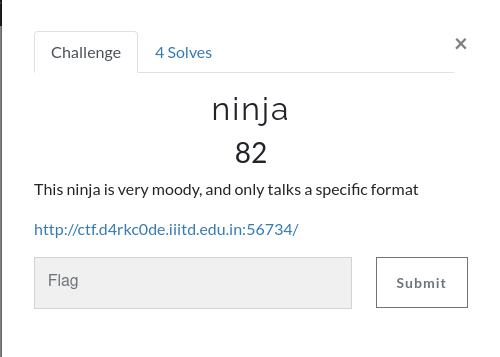
### Link
[http://ctf.d4rkc0de.iiitd.edu.in:56734](http://ctf.d4rkc0de.iiitd.edu.in:56734)
### Exploitation
  
  
Hosted on port 56734, usually on port 80.  
  
#### Initial Reconnaisance
**Nmap**  
  
Nmap is **short for Network Mapper**. It is an open-source Linux command-line tool that is used to scan IP addresses and ports in a network and to detect installed applications.  
  
**Ports?**  
  
so, basically think of IP address as a street number and think of ports as house numbers within that street number. There are a total of **65,535 ports** available for communication between devices!  
  
**Using Nmap**  
  
For using nmap we would first need to resolve the URL into an IP address.  
So, to there is something called DNS Lookup which basically takes in the host URL and returns to you the IP address associated with the URL.  
  
**URL**: ctf.d4rkc0de.iiitd.edu.in  
  
Let's run a basic “Ping” command on the hostname to see what the IP address is, and also to know if the host is up.  
  
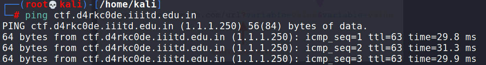  
  
We found the IP address - 1.1.1.250  
  
Let's run Nmap:  
  
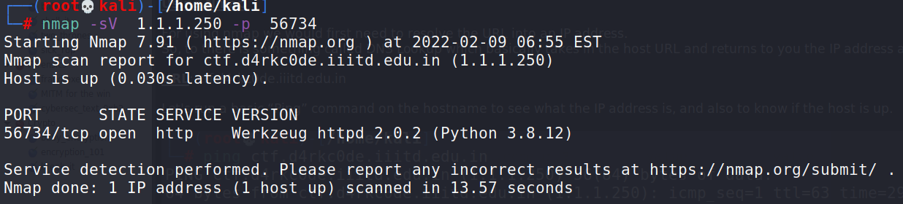  
  
The web application is running on port 56734 and -sV is a parameter that provides us with the service and the version running on that part, for example here the service is HTTP.  
We also see that Python 3.8 is being used. This might come handy later on.  
  
#### Coming back to the website:
  
Hmm, interesting.  
  
#### Parameter? 
URL parameters (also known as “query strings”) are a way to structure additional information for a given URL. Parameters are added to the end of a URL after a ‘?’ symbol, and multiple parameters can be included when separated by the ‘&’ symbol.  
  
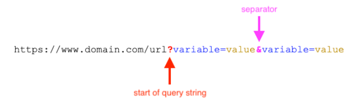  
  
Okay, so this means we need to add something to the url. Got it!  
  
#### Payload?
When data is sent over the Internet, each unit transmitted includes both header information and the actual data being sent. The header identifies the source and destination of the [packet](https://techterms.com/definition/packet), while the actual data is referred to as the payload. Because header information, or overhead data, is only used in the transmission process, it is stripped from the packet when it reaches its destination. Therefore, the payload is the only data received by the destination system.  

  
  
Okay, so that's done, maybe try passing something into the parameter? We'll try :

- 1. simple text  
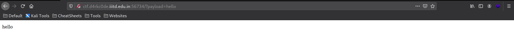  
  
Okay, so it printed out what we pushed into the field. Intresting. Let's now try to input some simple HTML tags and see what happens.  
  
- 2. HTML tags  
  
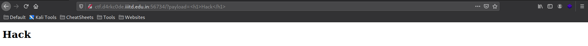  
  
OH!  
It seems like it's executing the HTML commands, this can be a major flaw. Let's exploit this.  
  
- 3. Javascript  
  
Okay, now that we know HTML commands are executing, we will try and pass javascript into it to see if that is executed as well.  
Let's pass a simple script for a popup in javascript.  
  
    Append : <script>alert("hello world");</script>
Link: [http://ctf.d4rkc0de.iiitd.edu.in:56734/?payload=%3Cscript%3Ealert(%22hello%20world%22);%3C/script%3E](http://ctf.d4rkc0de.iiitd.edu.in:56734/?payload=%3Cscript%3Ealert(%22hello%20world%22);%3C/script%3E)  
  
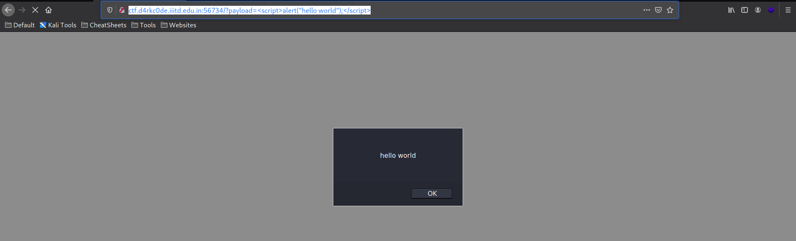  
  
Oh lovely! It is executing javascript as well.  
  
So, in websites which have dynamically changing elements, these are called **templates**.  
  
An example is the changing text here:  
  
Website: [https://sociallyencrypted.github.io/](https://sociallyencrypted.github.io/)  
  
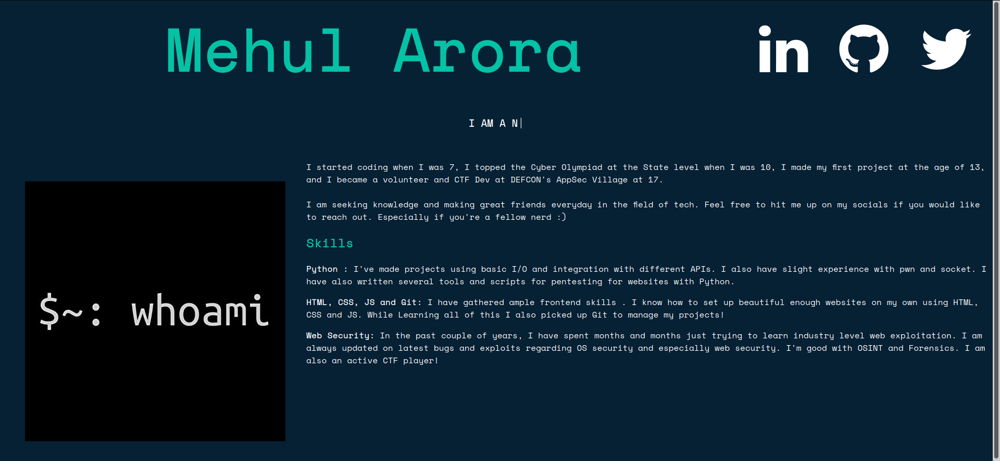  
  
  
As you can see, the “I am a” field keeps changing dynamically, this is a template.  
  
So, what terms do we have so far?  
- 1. Python  
- 2. Template  
- 3. Exploit (A very common word among hackers)  
  
Let's google search these three terms.  
  
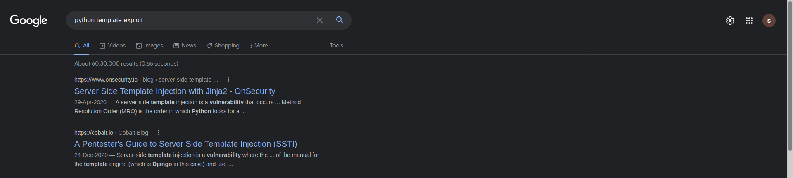  
  
We can see two terms, something called as SSTI or server side template injection and something called Jinja2.  
  
Okay, so maybe these are useful.  
  
So, when you type out Jinja2 template exploit, you will come across a few links, one of them is a Github link. Let's look into that.  
  
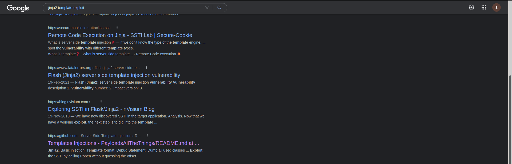  
  
Within the Github Page, scroll down to the Jinja2 section.  
  
Link: [https://github.com/swisskyrepo/PayloadsAllTheThings/blob/master/Server%20Side%20Template%20Injection/README.md#jinja2---basic-injection](https://github.com/swisskyrepo/PayloadsAllTheThings/blob/master/Server%20Side%20Template%20Injection/README.md#jinja2---basic-injection)  
  
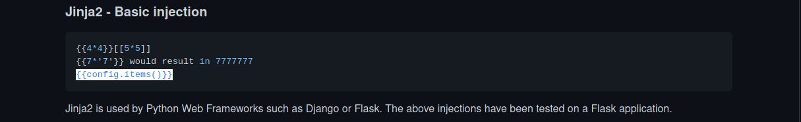  
  
As you can see there are 3 test commands we can run that should work when passed into the payload section.  
  
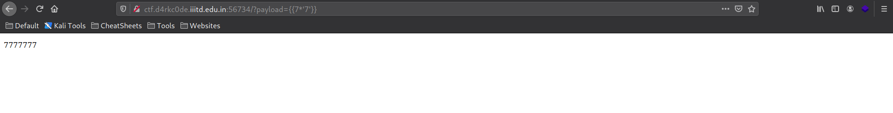  
  
It works perfectly.  
Let's try the last command present:  
  
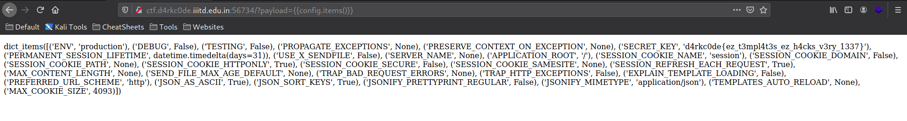  
  
Oof, thats a lot of data. Let's read through it once.  
  
Oh wait, I see something called a “Secret\_Key”, this might be something.  
  
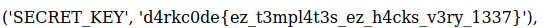  
  
Isn't this the flag format? Congratulations you have finally found the flag to the challenge and gained another 100 points!

## Tinder
### points: 200
### description: Tinder in a CTF??? Something fundamental is wrong
### link: [webpage](http://ctf.d4rkc0de.iiitd.edu.in:10003/), [webpage-source](https://github.com/d4rkc0de-club/RecruitmentCTF-2022/blob/main/WriteUps/Web/dz.zip)
### exploit
1. Open the webpage, doesn't look useful (in the sense you cannot make much out of it). Now download the source code and look at index.js (also available at `/Shenron`).
2. It looks like we can execute code (our code) by passing them as form parameters. Also, flag.pug is just a misdirection, we must trigger the other else if statement to render the flag  
  ```js
  if (context.answer === "correct") {
  res.render("flag");
  }
  else if(req.body.hide) {
  ```
3. Here we introduce an additional form parameter which will basically render whatever we ask for instead of Error Occured.  
    
4. Also note from the source code that the first two parameters must be valid array indices.  
  ```js
  if (code.length <= 12 && code1.length <= 12 && code2.length
  <= 35) {
  try {
  let context = {
  pair: [
  ["Goku", "Vegetta", "Krillin"],
  ["Chi-Chi", "Bulma", "Videl"]
  ],
  ```
5. For the purpose of getting the flag (which is located at /flag.txt, by reading the docker file), I passed the array indices as 1,2, and the third entry as require("fs") to create a file handling object (just nodejs things). Finally, to interact with the fs, use the hide parameter in the form (modify a POST request) to pass in `code=1&code1=2&code2=require("fs")&hide=pair[1][2].readFileSync("../../../flag.txt").toString()` as payload in post request  
    
Hit send, and here we have our response

### flag: d4rkc0de{Pr0t0_p0llut10n_1s_d4ng3rous} 
